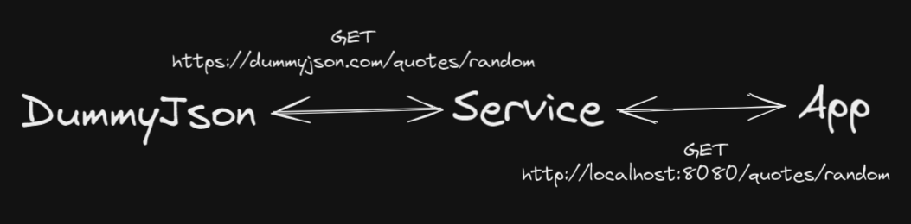
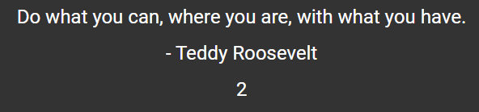
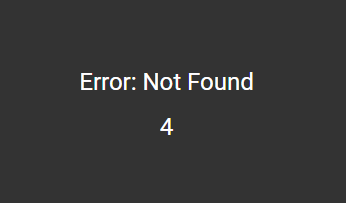

# Quote Service - Technical Challenge

The goal of this challenge is to create a basic SpringBoot REST API that calls [DummyJson](https://dummyjson.com/) for a random quote the App will display.

**_Bonus points for also writing a unit test._**

# Guidelines

Get started by cloning this repo and creating the new Service in the `service/` directory.

Remember:

- You must share your screen.

- Use the editor and tools you are comfortable with.

- Please ask questions if you are stuck. We are here to help.

- If you panic and forget something, show us your Google-fu.

# Overview

This diagram provides a high level overview:



1. App calls the Service at `GET` http://localhost:8080/quotes/random

2. Service calls DummyJson at `GET` https://dummyjson.com/quotes/random

3. Service returns the response to the App.

To make things easier there is a common model with three properties. For example:

DummyJson response:

```java
{
    id: 1,
    author: 'Teddy Roosevelt',
    quote: 'Do what you can, where you are, with what you have.'
}
```

App interface for Service response:

```typescript
interface Quote {
  id: number;
  author: string;
  quote: string;
}
```

The App is already written and you can use it to demo your work. On launch a call to `GET` http://localhost:8080/quotes/random will occur every ten seconds. A message and console log will be displayed on error.

Example of app working:



Example of app error:



# App

### Stack

- Node 16 LTS
- Angular 14

### Launching

`cd app` : Ensure you're in the right place.

`npm i` : Install packages

`npm run start` : Launch at http://localhost:4200
